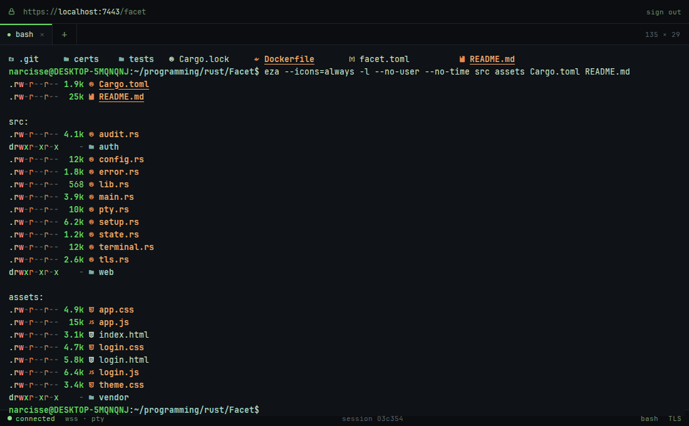
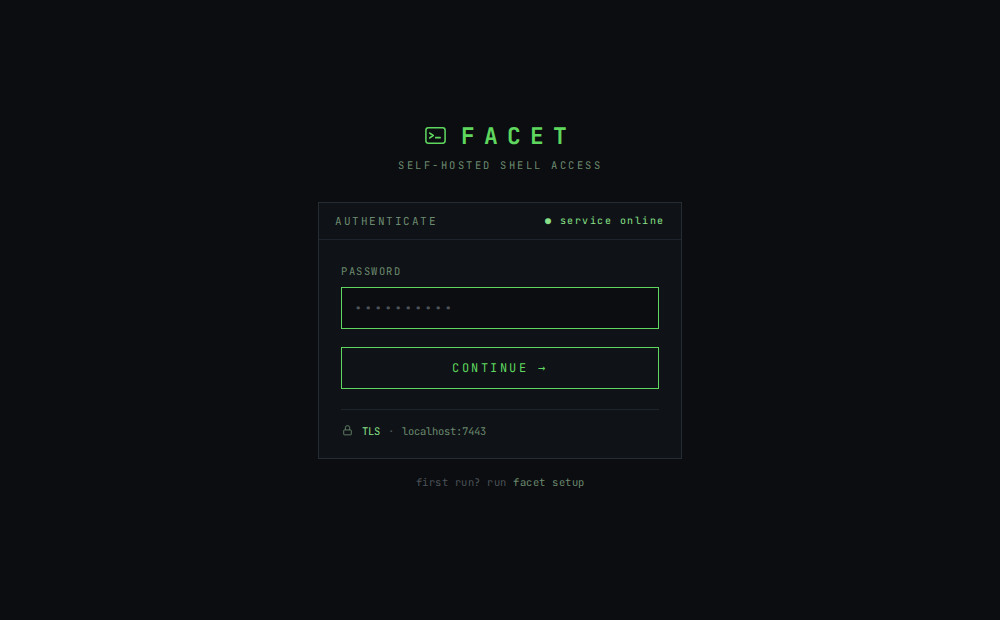

<div align="center">

# ▚ facet

**A single-binary web terminal. Your shell, in a browser, behind real authentication.**

[](https://github.com/crazydiamond007/Facet/actions/workflows/ci.yml)
[](#licence)
[](https://www.rust-lang.org)
[](#building)

</div>

<!-- TODO(screenshot): hero shot of the terminal UI. Add once the UI is final:
     <div align="center">
       
     </div>
-->

---

`facet` is a self-hosted agent you run on your own machine. It serves a browser-based
terminal, a real PTY with real colour and real `vim`, reachable from anywhere you can reach the
machine, and locked behind a password, a TOTP code and TLS.

One binary. No Node runtime, no `nginx` in front, no separate frontend to deploy. The web
UI is compiled into the executable.

```console
$ facet setup     # hash a password, print a TOTP QR, generate a certificate
$ facet run       # https://localhost:7443
```

## Why

Most browser terminals assume you will put authentication somewhere else: a reverse proxy,
a VPN, an SSO layer, "just don't expose it". That is a reasonable default right up until
someone forwards a port, at which point it is a root shell on the internet.

`facet` treats authentication as the product rather than a deployment concern:

- **There is no anonymous mode.** No `[auth]` section in the config and the server refuses
  to boot. There is no flag that turns it off.
- **TLS is on by default**, and disabling it on a non-loopback bind is a startup error, not
  a warning.
- **It binds `127.0.0.1`**, and the docs push you toward Tailscale or a Cloudflare Tunnel
  rather than a port-forward.

If you *want* an unauthenticated terminal, [`ttyd`](https://github.com/tsl0922/ttyd) is
excellent and you should use that instead.

## Features

- **A real terminal.** Cross-platform PTY via [`portable-pty`](https://crates.io/crates/portable-pty)
  (ConPTY on Windows, `forkpty` on Unix). Full 256-colour and true-colour ANSI, italics,
  mouse, `vim`, `htop`, `tmux`.
- **Two-factor login.** argon2id password + TOTP, then a short-lived JWT in an `httpOnly` /
  `Secure` / `SameSite=Strict` cookie.
- **Shells that survive a dropped connection.** Terminals live server-side and outlive their
  WebSocket. Shut the laptop on a train, open it an hour later, and your shell, plus its
  scrollback, is still there.
- **Tabs.** Several concurrent, independent shells.
- **Configurable shell.** WSL bash, PowerShell, `zsh`, `fish`, plus a starting directory
  and environment.
- **An audit log.** Every login (success *and* failure) and every terminal open/close, with
  a timestamp and an IP, as JSON lines.
- **One binary.** `rust-embed` compiles the HTML, CSS, JS and xterm.js into the executable.
  Copy it to a machine and run it.

## Project status

**Alpha, and feature-complete for what it sets out to do.** Every feature listed above is
implemented, tested, and has been driven end to end in a real browser. It is still young, it
has had no external security review, and you should read the [threat model](#threat-model)
before pointing it at anything you care about.

| | |
|---|---|
| Terminal, colour, resize, copy/paste | ✅ verified in a browser |
| Login: argon2id + TOTP + TLS | ✅ verified in a browser |
| Tabs, reattach, scrollback replay | ✅ verified in a browser |
| Linux / WSL2 | ✅ 49 tests green in CI |
| **Windows native** | ✅ **43 tests green in CI, on real ConPTY** |
| Docker (Linux) | ✅ image builds and runs in CI |
| `clippy` + `rustfmt` + `cargo audit` | ✅ clean in CI |
| Per-IP rate limiting on login | ✅ 6 tests, incl. header-spoofing |
| External security review | ❌ none |

The tests are not decoration. They boot a real server on a real port, log in with a real TOTP
code, open real WebSockets, and drive a real shell, on both Linux and Windows. They have
earned their keep several times over. Three bugs in this codebase were found by running them
and could not have been found any other way:

* A closed tab leaked its shell: removing the terminal from the registry dropped our `Arc`,
  but an attached socket held one too, so the child was never reaped.
* A WebSocket could never observe its own terminal closing, because it waited for a channel
  whose sender lived inside the very `Arc` it was holding. It was waiting on itself.
* **On Windows, the pty never signalled EOF.** ConPTY keeps its output pipe open for as long
  as the pseudoconsole exists, so closing the slave (which is all Unix needs) left the reader
  blocked forever and every session hanging. The master has to be closed too.

The Windows build needs no CMake and no NASM: `rustls` uses the `ring` provider and
`jsonwebtoken` uses `rust_crypto`, so a plain MSVC toolchain is enough. CI compiles and tests
it on `windows-latest` on every pull request.

## How it works

```
                ┌────────────────────────── your machine ──────────────────────────┐
                │                                                                  │
 ┌──────────┐   │   ┌───────────┐   ┌─────────────┐   ┌────────────┐   ┌────────┐  │
 │ browser  │ wss   │   axum    │   │ ws::bridge  │   │    PTY     │   │ shell  │  │
 │ xterm.js │◄──────┤  + rustls ├───┤             ├───┤   master   ├───┤  bash  │  │
 └──────────┘   │   └─────┬─────┘   └──────┬──────┘   └────────────┘   └────────┘  │
                │         │                │                                       │
                │     401 │                │ attach / detach                       │
                │   ┌─────▼──────┐  ┌──────▼────────┐                              │
                │   │    auth    │  │   terminal::  │  PTYs outlive their socket,  │
                │   │  argon2id  │  │    Manager    │  keeping scrollback so a     │
                │   │   TOTP     │  └───────────────┘  reconnect can replay it     │
                │   │   JWT      │                                                 │
                │   └────────────┘                                                 │
                └──────────────────────────────────────────────────────────────────┘
```

The WebSocket carries two kinds of frame, and that split is what makes colour work for free:

| Direction | Frame | Meaning |
|---|---|---|
| client → server | **binary** | raw stdin bytes for the shell |
| client → server | **text** | JSON control: `{"type":"resize","cols":120,"rows":40}` |
| server → client | **binary** | raw stdout/stderr from the shell |
| server → client | **text** | JSON control: `attached`, `exit`, `error` |

Terminal bytes are never parsed, escaped or re-encoded; they pass through untouched. In the
browser they go straight into xterm.js as a `Uint8Array` rather than a decoded string,
because xterm has a *stateful* UTF-8 decoder: a multi-byte character split across two
WebSocket frames still renders correctly. Decoding each frame in JavaScript would corrupt
exactly that case.

### The three details that are easy to get backwards

Each of these is a bug if you invert it, and each cost real debugging to get right:

1. **The PTY slave handle is dropped immediately after spawn.** Keep it, and the PTY never
   reports EOF when the shell exits, so the reader thread blocks forever and the socket
   hangs open. This is the classic way this kind of app leaks processes.
2. **End-of-session is signalled by PTY EOF, not by the child's exit status.** The reader
   only sees EOF *after* the shell's last bytes are drained, so waiting on it guarantees you
   see the whole `logout`. Racing the exit signal truncates output.
3. **Attach is atomic.** Subscribing to the live output stream and snapshotting the
   scrollback happen under one lock, so a reconnecting client sees every byte exactly once:
   no gap, no duplicate.

## Quick start

### Linux / macOS / WSL

```bash
git clone https://github.com/crazydiamond007/Facet
cd facet
cargo build --release

./target/release/facet setup    # asks for a password, prints a TOTP QR code
./target/release/facet run
```

Open **https://localhost:7443**, accept the self-signed certificate warning, and sign in with
your password and the six-digit code from your authenticator app.

`setup` draws the QR code directly in your terminal, so the secret never round-trips through
a screenshot or a clipboard. Scan it with Google Authenticator, Aegis, 1Password, Bitwarden,
anything that speaks TOTP.

<!-- TODO(screenshot): the login page. Add once the UI is final:
     <div align="center">
       
     </div>
-->

### Windows (native)

The binary must be built **on** Windows. You cannot cross-compile it from WSL without an
MSVC linker.

```powershell
git clone https://github.com/crazydiamond007/Facet
cd facet
cargo build --release

.\target\release\facet.exe setup
.\target\release\facet.exe run
```

The Windows build defaults to dropping you into **WSL bash** (`wsl.exe ~ -e bash -l`). For
PowerShell instead, edit `facet.toml`:

```toml
[shell]
program = "powershell.exe"
args = ["-NoLogo"]
```

### Docker

```bash
docker build -t facet .

# One-time setup. -it so it can prompt for a password and draw the QR.
docker run --rm -it -v facet-data:/home/facet/data facet setup

# Run. The `127.0.0.1:` prefix is the important part: it publishes the port on
# the host's loopback only, not on every interface.
docker run -d --name facet -p 127.0.0.1:7443:7443 -v facet-data:/home/facet/data facet
```

Inside a container the server has to bind `0.0.0.0` to be reachable at all, so set that in
the config, then let the `-p 127.0.0.1:...` publish (plus a tunnel) decide who can actually
reach it.

Note this gives you a shell **inside the container**, not on the host. That is usually not
what you want from a remote-shell tool; the image is most useful for running `facet` on a
Linux server where the container *is* the environment you care about.

## Building

### Dependencies

**Rust 1.85 or newer** (the crate uses edition 2024). That is very nearly all of it: the
dependency tree is pure Rust with one exception, and there is deliberately **no OpenSSL, no
CMake and no NASM** anywhere in it.

| Platform | You need |
|---|---|
| Debian / Ubuntu | `build-essential`, a C toolchain, for `ring`'s assembly |
| Fedora / RHEL | `gcc` |
| macOS | Xcode command-line tools |
| Windows | MSVC toolchain (Visual Studio Build Tools → "Desktop development with C++") |

There is **no Node.js build step.** `xterm.js` and its addons are vendored in
`assets/vendor/` and embedded at compile time.

### The main crates, and why

| Crate | Why |
|---|---|
| [`axum`](https://crates.io/crates/axum) + [`tokio`](https://crates.io/crates/tokio) | HTTP server and WebSocket upgrade |
| [`portable-pty`](https://crates.io/crates/portable-pty) | cross-platform PTY (ConPTY / `forkpty`), from the WezTerm project |
| [`rust-embed`](https://crates.io/crates/rust-embed) | compiles the web UI into the binary |
| [`argon2`](https://crates.io/crates/argon2) | password hashing (argon2id) |
| [`totp-rs`](https://crates.io/crates/totp-rs) | TOTP second factor, and the enrolment QR |
| [`jsonwebtoken`](https://crates.io/crates/jsonwebtoken) | session cookies, pinned to `rust_crypto`, so no CMake on Windows |
| [`rustls`](https://crates.io/crates/rustls) + [`axum-server`](https://crates.io/crates/axum-server) | TLS, pinned to the `ring` provider, so no NASM on Windows |
| [`rcgen`](https://crates.io/crates/rcgen) | generates the self-signed certificate during `setup` |
| [`tower-http`](https://crates.io/crates/tower-http) | security headers, body limits, tracing |
| [`xterm.js`](https://xtermjs.org/) | the terminal emulator in the browser (vendored, not npm) |

## Configuration

`facet setup` writes a working `facet.toml`. Every option is documented in
[`facet.example.toml`](facet.example.toml); the highlights:

```toml
[server]
bind = "127.0.0.1"          # read "Exposing it safely" before changing this
port = 7443
audit_log = "facet-audit.log"

[shell]
program = "/bin/bash"       # or "powershell.exe", "wsl.exe", "/usr/bin/fish"
args = ["-l"]
# cwd = "/home/you/projects"

[tls]
enabled = true              # false is only permitted on a loopback bind
cert = "certs/cert.pem"
key = "certs/key.pem"

[rate_limit]
enabled = true              # throttles the login endpoint only
per_seconds = 2             # seconds to earn back one attempt
burst = 10                  # attempts allowed back to back

[terminals]
max = 10                    # concurrent shells
scrollback_bytes = 262144   # replayed when you reconnect
detached_timeout_minutes = 60

[auth]                      # generated by `facet setup`
# password_hash, totp_secret, jwt_secret
session_ttl_minutes = 720
max_failed_attempts = 5
lockout_minutes = 15
```

### Keeping secrets out of the file

Each secret can come from the environment instead, and the environment wins over the file:

```bash
export FACET_PASSWORD_HASH='$argon2id$v=19$...'
export FACET_TOTP_SECRET='JBSWY3DP...'
export FACET_JWT_SECRET='base64...'
```

Handy with `systemd`'s `EnvironmentFile=`, a secrets manager, or a keychain. `facet.toml` is
written `chmod 600` and is in `.gitignore` either way.

### Logging

```bash
FACET_LOG=facet=debug,audit=info facet run
```

## Using it

| Key | Does |
|---|---|
| `Ctrl`+`Shift`+`C` | copy. Plain `Ctrl`+`C` stays free for `SIGINT`, which is the whole reason terminals moved copy onto Shift |
| `Ctrl`+`Shift`+`V` | paste (right-click paste and `Cmd`+`V` also work) |
| `Ctrl`+`Shift`+`T` | new terminal |
| `Ctrl`+`Shift`+`W` | close terminal, killing the shell |

Closing a **browser tab** merely detaches: the shell keeps running and you reattach on your
next visit. Clicking the **×** on a tab closes it for real and kills the shell.

## Security

### What it does

- **argon2id** password hashing, at the parameters OWASP currently recommends.
- **TOTP with replay protection.** A ±1-step skew window means a code stays valid for up to
  90 seconds, so `facet` records the time-step of every accepted code and refuses to go
  backwards. A code works exactly once.
- **A wrong password does not consume your TOTP code.** Otherwise an attacker could spend
  your codes by spamming bad passwords, locking you out of your own authenticator.
- **Both factors are always evaluated**, even when the password is already known to be wrong.
  Short-circuiting would make a bad password measurably faster than a bad code: an oracle
  telling an attacker they had already guessed the password.
- **Session cookie**: `__Host-` prefixed, `httpOnly`, `Secure`, `SameSite=Strict`. The
  `__Host-` prefix is enforced *by the browser*: such a cookie must be Secure, must be
  `Path=/`, and must carry no `Domain`, so a sibling subdomain cannot plant a session on you.
- **CSRF**: double-submit token on the login POST.
- **Origin check** on the WebSocket upgrade, against cross-site WebSocket hijacking. A
  *missing* `Origin` is refused, not waved through.
- **Lockout** after N consecutive failures.
- **Per-IP rate limiting** on the login endpoint. Not the brute-force defence (the lockout
  is); this one exists because argon2 is *deliberately* expensive, so an unauthenticated
  flood of login attempts is a cheap way to pin a CPU and starve the terminals the machine
  is there to serve. The limiter refuses the flood before it reaches argon2. Only the login
  endpoint is throttled: throttling the terminal's own traffic would throttle the point of
  the program.
- **Content-Security-Policy** of `default-src 'none'`, with no inline script anywhere.
- **Audit log** of every authentication decision and every terminal, with IP and timestamp.
- **No secrets in the binary.** They are generated by `setup` into a `chmod 600` file, or
  read from the environment.
- **No `unwrap()` / `expect()` in any request or WebSocket path.** Typed errors throughout;
  an internal error never describes your filesystem to a caller.

### Threat model

**What `facet` is built to stop**

- Someone who finds the port open and tries to log in. They need the password *and* a live
  TOTP code, and are locked out after five tries.
- Passive network eavesdropping. TLS is on by default.
- A malicious website trying to drive your terminal through your logged-in browser
  (`SameSite=Strict`, the `Origin` check, and the CSRF token).
- An offline attack on a stolen `facet.toml` (argon2id, salted, tuned).
- Session-cookie theft via XSS (`httpOnly`, plus a CSP that forbids inline script at all).

**What it does *not* stop. Please read this part**

- **Anyone who authenticates gets a shell as the user running `facet`.** That is the entire
  purpose. There is no sandbox, no restricted command set, no sudo gate. Run it as a user
  whose privileges you are willing to hand to whoever holds your password and TOTP seed.
- **`logout` does not revoke the token.** The JWT is stateless: the cookie is dropped from
  your browser, but a copy of that token remains valid until it expires (12h by default). To
  kill every session, rotate `auth.jwt_secret` and restart.
- **An established WebSocket outlives token expiry.** The token is checked at upgrade, not
  continuously, so a shell opened at hour 0 keeps running past the session TTL. To terminate
  live sessions, restart the process.
- **The lockout is global, not per-IP.** Per-IP is useless against an attacker who rotates
  addresses, but the cost is that anyone who can reach your login page can lock *you* out
  for `lockout_minutes`. This is the single strongest argument for a tunnel over a public
  port.
- **Rate limiting is only as trustworthy as the IP it keys on.** By default facet uses the
  TCP peer, which is right when it is reachable directly, but behind a tunnel that is
  `127.0.0.1` for everybody: the limiter collapses to one shared bucket, and the audit log
  records the tunnel rather than the caller. Setting `server.trust_forwarded_for = true`
  fixes both, but *only* if a proxy you control is actually in front and overwrites the
  header. Turn it on with nothing in front and an attacker gets a fresh bucket per request
  by editing a header, and can write whatever IP they like into your audit log.
- **A self-signed certificate gives you encryption, not identity.** It stops passive
  sniffing; it does not stop an active man-in-the-middle who can get between you and the
  host. That is fine on loopback, and fine over Tailscale (which authenticates the peer
  itself). It is *not* fine across the open internet. Use a real certificate, or a tunnel
  that terminates TLS for you.
- **Compromise of the machine compromises everything.** It holds the hash, the TOTP seed and
  the signing key.
- **No protection against you.** If you `rm -rf` something through the terminal, that is the
  feature working correctly.

### Exposing it safely

The default bind is `127.0.0.1`. To reach it from elsewhere, **do not forward a port.** Put
an authenticated network layer in front of it. Both options below leave `facet` on loopback,
so there is no open port for anyone to find.

#### Tailscale (recommended)

Your machines join a private WireGuard network; nothing is exposed to the public internet at
all.

```bash
# facet stays on 127.0.0.1:7443, so no config change is needed.
tailscale serve --bg --https=443 https+insecure://127.0.0.1:7443
```

Tailscale terminates TLS with a real, valid certificate for your `*.ts.net` name, and only
your own devices can connect. Reach it at `https://your-machine.your-tailnet.ts.net`.
(`https+insecure` only means "don't validate facet's self-signed cert on the loopback hop",
a hop that never leaves the machine.)

You can then also set `tls.enabled = false` in `facet.toml`, since Tailscale is doing TLS
properly and the remaining hop is loopback.

#### Cloudflare Tunnel

Good when you want a public hostname. The tunnel dials *out*, so again there is no inbound
port.

```bash
cloudflared tunnel --url https://localhost:7443 --no-tls-verify
```

For anything long-lived, put **Cloudflare Access** in front of it, so there is a second,
independent authentication layer between the internet and your login page. If the proxy
rewrites `Host`, add your public hostname to `server.allowed_origins`.

#### Why not a port-forward

Forwarding `7443` on your router puts your login page in front of the entire internet and
every scanner on it. `facet` is built to survive that, but the global lockout means a
determined stranger can keep *you* locked out of your own machine, and any future
authentication bug becomes a remote shell. A tunnel costs ten minutes and deletes the whole
class of problem.

### Reporting a vulnerability

See [SECURITY.md](SECURITY.md). Please don't open a public issue for a security bug.

## Development

```
src/
  main.rs        CLI (run | setup), server bootstrap, TLS
  config.rs      TOML config + the startup safety interlocks
  error.rs       typed errors; internal detail never reaches a response body
  pty.rs         cross-platform PTY: blocking threads bridged into tokio
  terminal.rs    the terminal registry: PTYs that outlive their socket
  auth/
    mod.rs       Authenticator: the login decision, and lockout
    password.rs  argon2id
    totp.rs      TOTP + replay protection
    token.rs     JWT session cookies
  web/
    mod.rs       router, CSP, security headers
    login.rs     login page, CSRF, session cookie
    ws.rs        the WebSocket ⇄ PTY bridge
    api.rs       JSON API behind the tab bar
    assets.rs    rust-embed, ETags
  audit.rs       append-only JSON-lines audit log
  setup.rs       `facet setup`
  tls.rs         rustls, and the self-signed certificate

assets/          the web UI, embedded into the binary at build time
tests/           integration tests: they boot a real server on a real port
```

```bash
cargo test                    # unit + integration
cargo clippy --all-targets
cargo fmt
```

The integration tests boot a real server, log in over HTTP, open real WebSockets and drive a
real shell. `tests/common/mod.rs` holds the harness, including a helper that computes a live
TOTP code, because the tests have to authenticate exactly like you do.

One test idiom you will see everywhere: commands are written so their *output* differs
textually from what was typed (`echo A$((6*7))Z` → `A42Z`). A PTY echoes your keystrokes
back, so asserting on the text you sent proves nothing. `A42Z` can only come from the shell
having actually executed the line.

## Known limitations

- **Reconnecting inside a full-screen app can render oddly.** Scrollback replay is raw ANSI,
  so if you disconnect while in `vim` or `htop`, the alternate-screen state is not
  reconstructed. `Ctrl`+`L` (or `:redraw!`) fixes it.
- **Single user.** By design: one password, one TOTP seed, one shell identity.
- **No session sharing or read-only observers.** Two browsers attached to the same terminal
  will fight over it.

## Roadmap

- [x] Validate the native Windows build (CI runs the suite on real ConPTY)
- [x] CI: `fmt`, `clippy`, `cargo audit`, tests on Linux and Windows, Docker build
- [x] Per-IP rate limiting on the login endpoint (`tower_governor`)
- [ ] Revocable sessions (token version, or a server-side session id)
- [ ] Reconstruct alternate-screen state on reattach
- [ ] Prebuilt binaries on the releases page

## Contributing

Issues and PRs welcome; see [CONTRIBUTING.md](CONTRIBUTING.md).

## Licence

Dual-licensed under either of

- Apache License, Version 2.0 ([LICENSE-APACHE](LICENSE-APACHE))
- MIT license ([LICENSE-MIT](LICENSE-MIT))

at your option, the standard Rust convention.

Unless you explicitly state otherwise, any contribution you intentionally submit for
inclusion in this work shall be dual-licensed as above, without any additional terms.
